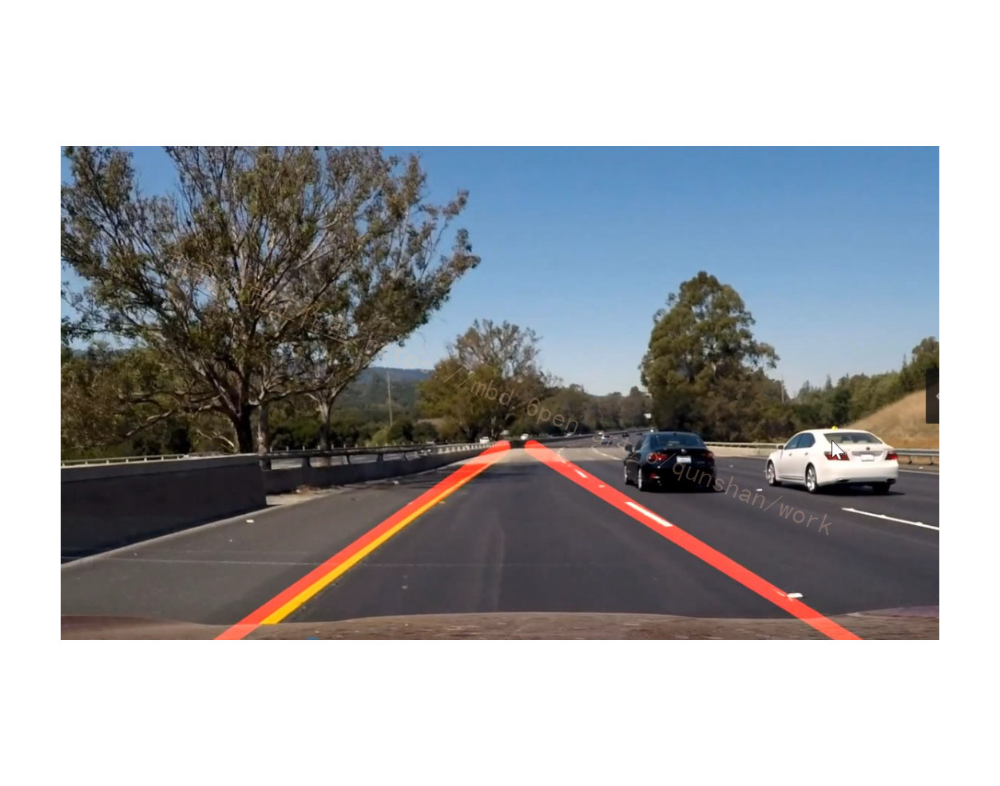

# 1.图片演示


# 2.视频演示
[Python基于OpenCV的视频车道线检测系统[源码＆部署教程]](https://www.bilibili.com/video/BV1ZP41137Ny?spm_id_from=333.999.0.0&vd_source=bc9aec86d164b67a7004b996143742dc)

# 3.边缘检测
[参考该博客方案](https://mbd.pub/o/bread/Y5WamZtp)，其算法思想如下：
1. 使用高斯模糊，去除噪音点（cv2.GaussianBlur）
2. 灰度转换（cv2.cvtColor）
3. 使用sobel算子，计算出每个点的梯度大小和梯度方向
4. 使用非极大值抑制(只有最大的保留)，消除边缘检测带来的杂散效应
5. 应用双阈值，来确定真实和潜在的边缘
6. 通过抑制弱边缘来完成最终的边缘检测
#### 1.高斯滤波
```
gaussian = cv2.GaussianBlur(color_img, (gaussian_ksize,gaussian_ksize), gaussian_sigmax)
```
color_img 输入图片
gaussian_ksize 高斯核大小，可以为方形矩阵，也可以为矩形
gaussian_sigmax X方向上的高斯核标准偏差

#### 2.图片转换
```
gray_img = cv2.cvtColor(input_image, flag)
```
用于颜色空间转换。input_image为需要转换的图片，flag为转换的类型，返回值为颜色空间转换后的图片矩阵。flag对应：
cv2.COLOR_BGR2GRAY BGR -> Gray
cv2.COLOR_BGR2RGB BGR -> RGB
cv2.COLOR_BGR2HSV BGR -> HSV
可以了解一下该函数和cv2.imread()的区别

#### 3.边缘检测
```
edge_img = cv2.Canny(gray_img,canny_threshold1,canny_threshold2)
```
imag为所操作的图片，threshold1为下阈值，threshold2为上阈值，返回值为边缘图。


# 4.ROI and mask
利用数组选取ROI(region of interest,感性趣的区域，然后与原图进行布尔运算(与运算)。

```
poly_pts = numpy.array([[[0,368],[300,210],[340,210],[640,368]]])
```
四个数组创建后保存在变量poly_pts中。
```
mask = np.zeros_like(gray_img)
```
构建一个与gray_img同维度的数组，并初始化所有变量为零。
```
cv2.fillPoly(mask, pts, color)
```
绘制多边形函数。mask为绘制对像，pts为绘制范围，color为绘制颜色。
```
img_mask = cv2.bitwise_and(gray_img, mask)
```
与运算


# 5.霍夫变换
```
lines = cv2.HoughLinesP(edge_img,  1, np.pi / 180, 15, minLineLength=40, maxLineGap=20)
```
edge_img: 要检测的图片矩阵
参数2: 距离r的精度,值越大,考虑越多的线
参数3: 距离theta的精度,值越大,考虑越多的线
参数4: 累加数阈值,值越小,考虑越多的线
minLineLength: 最短长度阈值,短于这个长度的线会被排除
maxLineGap:同一直线两点之间的最大距离
返回值::
[np.array([[x_1,y_1, x_2, y_2]]),
np.array([[x_1, y_1, x_2, y_2]]),
…,
np.array([[x_1, y_1, x_2, y_2]])]

# 6.离群值过滤
[受该博客思路启发，循环查找超出设定范围的斜率，并去除](https://afdian.net/item?plan_id=2f4d3d58625111ed88d152540025c377)。
```
idx = np.argmax(diff)
```
当diff中存放的是一维时，找到diff中最大的数值，并返回该值所在位置。
从列表lines中把第idx数去除

# 7.车道线标注
```
cv2.line(img, tuple(line[0]), tuple(line[1]), color,thickness)
```
在图片上画线，img为所标注的目标图片，ine[0]为起点坐标，line[1]为终点坐标，thickness为线宽。
注意两个坐标需要为tuple元组格式，即tuple(line[0])


# 8.系统整合
下图[完整源码＆环境部署视频教程](https://s.xiaocichang.com/s/4149b5)

参考博客[《Python基于OpenCV的视频车道线检测系统\[源码＆部署教程\]》](https://mbd.pub/o/qunma/work)


# 9.参考文献
*   *[1]*[基于改进Hough变换的车道线识别](https://kns.cnki.net/kcms/detail/detail.aspx?filename=SXDS202106012&dbcode=CJFD&dbname=CJFD2021&v=hJej5pxuFEzHMB9I1foLJySODrysESKlYX7GPFWGeFM0eQK6ydtbVt-sjHQusG3p)[J]. 辛敏,罗山.  山西电子技术. 2021(06)
*   *[2]*[基于改进Hough变换的车道线检测](https://kns.cnki.net/kcms/detail/detail.aspx?filename=SXQC202107006&dbcode=CJFD&dbname=CJFD2021&v=CRV_0b2A8SFBvI527gOI77pgQH5AFi6jp_NZQMaFr9oukez6f2ScZwN4wmUowpzl)[J]. 李后隆,马骊溟,钟林伟.  汽车实用技术. 2021(07)
*   *[3]*[基于改进Hough变换与双点去除R-最小二乘法的车道线检测优化算法](https://kns.cnki.net/kcms/detail/detail.aspx?filename=KXJS202005054&dbcode=CJFD&dbname=CJFD2020&v=7ufNVsW8Ho_uLhyvsFSw5-mf7iGOO_vXnlTzbG16VHfqrtrQg1rYbL4J_HDwpgy5)[J]. 姜立标,李静轩.  科学技术与工程. 2020(05)
*   *[4]*[基于改进Hough变换的结构化道路车道线识别](https://kns.cnki.net/kcms/detail/detail.aspx?filename=KXJS202026041&dbcode=CJFD&dbname=CJFD2020&v=7ufNVsW8Ho9RWCMJdJaSDgPuVVh7ggc2C2ILoObrln4nQR45Sj15riiRslo1j8Q1)[J]. 陈政宏,李爱娟,王希波,葛庆英,韩文尧,刘刚.  科学技术与工程. 2020(26)
*   *[5]*[基于叠加约束的Hough变换车道线检测研究](https://kns.cnki.net/kcms/detail/detail.aspx?filename=YXDJ201903010&dbcode=CJFD&dbname=CJFD2019&v=DPo6jhEIGONyMtd8rnHM9rBNICTYwQyBZCztSp2pr9i_pme5RdeEr8a44gliPvER)[J]. 伍玲玲,林志贤,郭太良.  有线电视技术. 2019(03)
*   *[6]*[基于Hough变换的车道线检测算法设计](https://kns.cnki.net/kcms/detail/detail.aspx?filename=SDLG201911022&dbcode=CJFD&dbname=CJFD2019&v=Vwalx3XAwkDr43eOtyamaxiSN_u4WLX0t6XkDxeoYNsxZZLRLpdn4cCPy_mHTs-5)[J]. 何旭光,江磊,罗一平,张伟伟.  农业装备与车辆工程. 2019(11)
*   *[7]*[基于Hough变换的车道线检测](https://kns.cnki.net/kcms/detail/detail.aspx?filename=SDGJ201710236&dbcode=CJFD&dbname=CJFD2017&v=RI4_BvRfjVhEGSp-9kOzxxa_V2E5MdVjA5I10eLIgESNg9QMCUiELIMT_xr5iZxB)[J]. 钱怡.  山东工业技术. 2017(10)
*   *[8]*[Hough变换的车道线并行检测](https://kns.cnki.net/kcms/detail/detail.aspx?filename=DZKK201512028&dbcode=CJFD&dbname=CJFD2015&v=iN1md_QPjdN5J-W8ZYWixoTeIAG70FQwzF5bDXgeU9oBwPxbWA31P-IZ9WqfsTd2)[J]. 王赛,徐伯庆,苏栋骐.  电子科技. 2015(12)
*   *[9]*[一种改进Hough变换的车道线检测算法](https://kns.cnki.net/kcms/detail/detail.aspx?filename=JSSG201411040&dbcode=CJFD&dbname=CJFD2014&v=V_nRtn35IOkNRGJyeD0anQkAMB8Ltk6pPFBMa5kEN-4qbJX1wAXd0ZQkX3ZUJb2K)[J]. 王全.  计算机与数字工程. 2014(11)
*   *[10]*[一种基于 Hough 变换的车道线检测新方法](https://kns.cnki.net/kcms/detail/detail.aspx?filename=OXZG201304001&dbcode=CJFD&dbname=CJFD2013&v=AKKUylPNebSJwYMBkybvm0GWlbo9Yqq9-AYxLg4BlNvANjGTrVWFbGcFyuGYic0A)[J]. 许宏科,秦严严.  徐州工程学院学报(自然科学版). 2013(04)


---
#### 如果您需要更详细的【源码和环境部署教程】，除了通过【系统整合】小节的链接获取之外，还可以通过邮箱以下途径获取:
#### 1.请先在GitHub上为该项目点赞（Star），编辑一封邮件，附上点赞的截图、项目的中文描述概述（About）以及您的用途需求，发送到我们的邮箱
#### sharecode@yeah.net
#### 2.我们收到邮件后会定期根据邮件的接收顺序将【完整源码和环境部署教程】发送到您的邮箱。
#### 【免责声明】本文来源于用户投稿，如果侵犯任何第三方的合法权益，可通过邮箱联系删除。